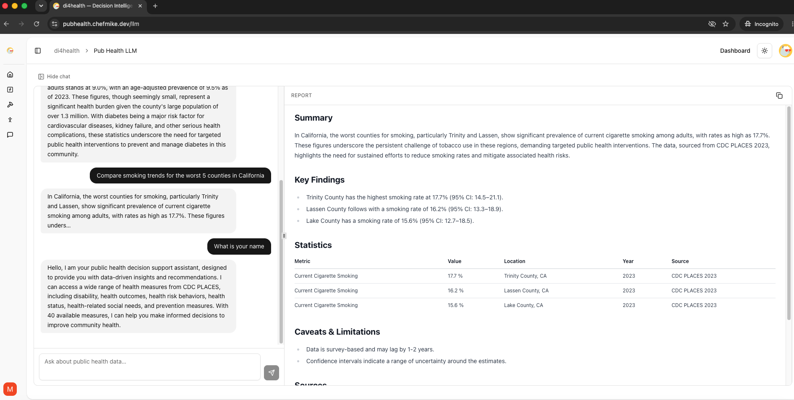
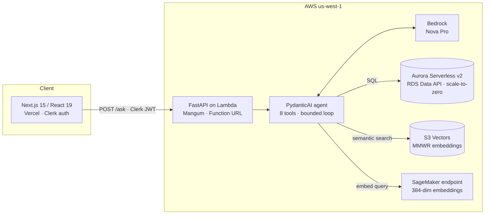

# pubHealthLLM

**AI-powered decision support for public health — evidence-backed answers from real CDC data, delivered as structured, citable reports.**

Live app: [pubhealth.chefmike.dev](https://pubhealth.chefmike.dev) · Frontend branded as **di4health** (Decision Intelligence 4 Health)




## What it does

Ask a question a county health official would actually ask — *"Which three Texas counties should I prioritize for a diabetes prevention program?"* — and get back a structured report: a decision-ready narrative summary, the exact statistics with confidence intervals and years, historical surveillance context, explicit caveats, and full source citations. Every number in every answer comes from a tool call against real CDC data; the model is not permitted to answer from its own memory.

Three datasets power it (live counts from the production database):

| Source | What it provides | Scale |
|---|---|---|
| CDC PLACES 2023 | 40 county-level health measures (diabetes, obesity, smoking…) | 3,144 US counties · 229k data points |
| CDC MMWR | Weekly surveillance reports (2022–2024), semantically searchable | Embedded report passages in S3 Vectors |
| CDC NCHS Mortality | Death counts and age-adjusted rates by cause | State-level, 1999–2017 · 10.8k records |

## Architecture



**Request lifecycle.** A signed-in user's question hits `POST /ask` with a Clerk JWT. A PydanticAI agent running on Bedrock Nova Pro plans tool calls against the CDC data — SQL over Aurora via the RDS Data API, semantic search over MMWR report passages in S3 Vectors (query embeddings from a SageMaker endpoint). The agent must deliver its answer through a Pydantic `PublicHealthResponse` schema — that schema *is* the API contract, so the frontend renders validated structure, never free-form model text. Responses with statistics render as a report artifact in a resizable panel; conversational replies stay in the chat thread.

## Technology choices, and why

| Choice | Why |
|---|---|
| **PydanticAI + structured output** | The agent's final answer is a validated Pydantic model, not prose. Malformed output fails loudly at the schema, not silently in the UI. |
| **Amazon Bedrock (Nova Pro)** | IAM-authenticated model access — no API keys to leak, one bill, and the whole request path stays inside AWS. |
| **Aurora Serverless v2, scale-to-zero** | The database costs ~nothing while idle and auto-pauses after 5 minutes. The app treats the resume delay as a first-class UX state (see production notes below). |
| **S3 Vectors** | AWS's serverless vector store — no vector-DB cluster to run for a corpus of this size. |
| **Lambda + Mangum + Function URL** | The entire backend is a zip deploy that scales to zero. No containers, no idle compute. |
| **Clerk** | Auth from day one — `/ask` and `/measures` have never been public. JWTs verified server-side against Clerk's JWKS. |
| **Terraform** | All AWS infrastructure is code, in staged roots under `terraform/` (SageMaker, ingestion, database, backend). |
| **Next.js 15 / React 19 / shadcn / Tailwind 4** | The di4health frontend: resizable chat + artifact panels, markdown report rendering, dark mode. |

## Engineering notes from production

Things that actually broke, what the logs showed, and what shipped — because a serverless agentic system fails in more interesting ways than a CRUD app.

**Agent non-convergence.** An intermittent failure where a question would time out once, then succeed on immediate retry. CloudWatch showed the real cause: the agent occasionally looped 50 model round-trips without converging (162 seconds, `UsageLimitExceeded`) — no database errors, nothing wrong with the data. The fix: bound the loop at 12 requests (env-tunable via `PUBHEALTH_REQUEST_LIMIT`), fail fast at ~40s instead of 162s, and auto-retry once — the loop is non-deterministic, so a bounded retry usually converges. Failed first attempts log their full tool-call sequence, so any recurring thrash pattern is diagnosable straight from CloudWatch.

**Cold database as a UX state.** Aurora's scale-to-zero saves real money, but the first query after idle can wait ~30 seconds for the cluster to resume. Rather than disable auto-pause, the app makes warming honest: page load fires `GET /warmup`, which sends a single non-blocking `SELECT 1` — the attempt itself initiates the resume — and reports `warming`/`ready`. The UI shows a calm "waking up the health database" indicator and polls until ready. The Data API client's retry path absorbs the race where a user asks before the resume completes.

**Errors as answers.** Tool failures return descriptive strings, not exceptions, so the agent can explain "that county doesn't exist" instead of crashing the run. Top-level agent failures degrade to an apologetic structured response — the endpoint never throws a bare 500 at a user.

## API

| Endpoint | Auth | Purpose |
|---|---|---|
| `GET /health` | public | liveness |
| `GET /warmup` | Clerk JWT | initiate/report Aurora resume |
| `POST /ask` | Clerk JWT | question → structured `AskResponse` |
| `GET /measures` | Clerk JWT | CDC PLACES measure catalog |

## Getting started

**Backend** (Python ≥ 3.11, [uv](https://docs.astral.sh/uv/)):

```bash
cd backend
uv sync
cp .env.example .env   # then fill in the values below
uv run uvicorn server:app --reload --port 8000
```

The backend talks to live AWS resources — there is no local database. Required environment: `AWS_REGION`, `AURORA_CLUSTER_ARN`, `AURORA_SECRET_ARN`, `AURORA_DATABASE`, `VECTOR_BUCKET`, `INDEX_NAME`, `SAGEMAKER_ENDPOINT`, and `CLERK_JWKS_URL`, with AWS credentials that can reach Bedrock, the RDS Data API, S3 Vectors, and SageMaker in `us-west-1`. Optional: `PUBHEALTH_MODEL` (defaults to `bedrock:us.amazon.nova-pro-v1:0`; `anthropic:` and `openai:` providers are also supported) and `PUBHEALTH_REQUEST_LIMIT`.

**Frontend** (Node + [pnpm](https://pnpm.io/)):

```bash
cd frontend
pnpm install
cp .env.example .env.local   # Clerk keys + NEXT_PUBLIC_API_URL
pnpm dev
```

Infrastructure is provisioned from the staged Terraform roots in `terraform/` — SageMaker embedding endpoint, data ingestion, Aurora, and the Lambda backend, in that order.

## Testing

Built test-first. **720 pytest tests** across the agent, tools, HTTP layer, ingestion pipeline, and schemas — the default run is fully offline (AWS and LLM calls mocked); live integration tests are opt-in via environment keys. An LLM eval harness (`pubhealth_llm/evals/`) scores answer quality and tool-selection behavior against a fixture set. Frontend verification is `pnpm build` + lint + manual smoke.

```bash
cd backend && uv run pytest tests/ -v
```

## Repository layout

```
backend/
├── server.py               # FastAPI app (HTTP layer only)
├── lambda_handler.py       # Mangum entry point for AWS Lambda
├── pubhealth_llm/
│   ├── app/                # agent, tools, schemas, orchestrator, Data API client
│   ├── data_ingestion/     # CDC PLACES / MMWR / mortality → Aurora + S3 Vectors
│   ├── evals/              # LLM answer-quality eval harness
│   └── decision_tree/      # health-economic Monte Carlo engine (roadmap)
└── tests/                  # 720 tests, offline by default
frontend/                   # Next.js app (di4health)
terraform/                  # staged IaC roots (SageMaker, ingestion, database, backend)
```

## Roadmap

- SSE progress streaming for long agentic runs (via Lambda Web Adapter)
- Multi-turn conversation history on `/ask`
- Decision modeling & cost-effectiveness analysis (the decision-tree engine)
- Per-user rate limiting on `/ask`

## Acknowledgments

Frontend content and framing adapted from [di4health](https://di4health.github.io) — a project of TEAM Public Health (Tomás Aragón). Data: CDC PLACES, CDC MMWR, CDC NCHS.

*This tool provides decision support only; all recommendations require validation by qualified public health professionals.*
